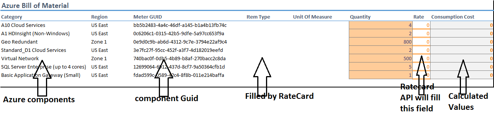

# Azure Rate Card API Integration
This guide provides a step-by-step guide on how to use the Azure Ratecard API to calculate the cost of Azure consumption.  In this demonstration you will show how to 
* Configure Azure subscription to accept Rate card related API queries from custom applications
* Using the Power-shell script, download the Azure Rate Card API from your subscription into a character delimited file
* Upload the data into Excel and use it to calculate Azure consumption

## Pre-requisites

* Azure subscription
* Azure SDK 2.7 or higher
* Azure Powershell 0.98
  * Azure Powershell 1+ breaks the Powershell script
* Visual Studio 2015
* Microsoft Excel

* [Power Shell Code](./ConvertRateCardAPIToFormatedFile.ps1)
* [Configured Excel](./AzureRateCardtoBoMimplementation.xlsm?raw=1)
* [Demo Script - Word Format](./AzureRateCardAPI-demoscript.docx?raw=1)

## Setup

*Estimated time: 15 minutes*

1. Login to your Azure management portal (https://manage.windowsazure.com) and click on the Settings tab

2. The directory that you connect to should now be visible under the **Settings --> Subscriptions** tab

###
**(A)**	make a note of this ad. you will use this information in our client application.
###

3. Next you need to ensure that the client application is authorized to connect to your azure subscription to obtain all the rate information. In order to allow this access, we need to create an entry in our directory. 
 
4. Select **Active Directory -->Name** of directory which is applicable to all your subscription. 

###
Next create a client application record. This will allow client applications to access to the Ratecard API’s

5. Click on the **Applications** Tab

Click **Add** at the bottom in the resulting screen. 

6. In the confirmation screen shown, select **“Add an application my organization is developing”**. 

 

7. In the next **Add Application** dialog, add a dummy name, select type as **“Native Client Application”** and click **next**. 

 
8. Select the newly created application and click **configure**

 

###
**(B)**	Make a note of the **Client-ID**. Client application will need to pass this ID when it wants to access the API data. 

**(C)** In the **Re-direct URI**, enter https://localhost/. You will use the same value in the client application. Make sure that the format is exact – including the ending forward slash - in the client application.

Ensure that in the ‘permissions to access other applications’ section, you’ve allowed permission to access the Azure Service Management (preview) services. 

###
9. After making note of Client ID and redirect URLs, click **Add Application** button at the end

 

10. Update the **Delegated Permissions** and ensure that ‘**Access Azure Service Management (preview)**’ is checked. 
Finally click **Save**. 

  

The Azure subscription and application is now all set to access the Rate Card API. 
Lastly, we need information about the Offer-Id for the subscription as the Rate Card is dependent on this information

11. Navigate to your Azure subscriptions page: Enter the following URL into your browser - https://account.windowsazure.com/Subscriptions
12. Next, Select the subscription which you’ve used to configure the client access APIS. This should bring you to the Billing page. Scroll down and make a note of the Azure **offer-ID** and **subscription id** applicable for this subscription. 

 

###
**(D)**	Make a note of the Subscription ID

**(E)**	Make a note of the OFFER-ID
### Execute Script

In this section, substitute the values obtained in previous step inside the PowerShell script, execute the power shell script and download the resulting files. 

Name of PowerShell script file = ‘**ConvertRateCardAPIToFormatedFile.ps1**’. It’s available as [Power Shell Code](./ConvertRateCardAPIToFormatedFile.ps1). 

    1.	Open this file from the desktop application – ‘**Windows Powershell ISE**’ IDE. 

> Brief Description of the shell script. 
> 1.	It logs on to the Azure subscription using the credentials provided. 
> 2.	It downloads the Rate Card data relevant for that offer-id.
> 3.	It copies the Rate card data into a ‘Json formatted’ form. File name is ‘'**\resourcecard.json**' and its copied to the location - **C:\Users\<username>\AppData\Local\Temp** 
> 4.	Script then filters and picks up only the ‘**Meters**’ data and converts the Json formatted data into a ‘**!**’ – exclamation mark -  character delimited file.  
>       a. We will use this delimiting character to load the file into Excel. 
> 5.	The output of this formatted data is written to file ‘**ratecardoutput.txt**’ which is copied to the folder -** C:\Users\<username>\AppData\Local\Temp**

    2.	In order to execute the shell script and substitute the values as shown below
<Table>
    <tr>
        <td>Noted from Azure Management Portal</td>
        <td>Shell Script Variable name</td>
        <td>Format & example</td>
     </tr>
    <tr>
        <td>
        <b>(A)</b>
        </td>
        <td>
            $adTenant 
        </td>
        <td>
            $adTenant  =  "microsoft.onmicrosoft.com" 
        </td>
    </tr>
    <tr>
        <td>
        <b>(B)</b>
        </td>
        <td>
            $clientId 
        </td>
        <td>
            $clientId  =  "XXXXXXXX-XXXX-4d50-937a-96e123b13015"  
        </td>
    </tr>
    <tr>
        <td>
        <b>(C)</b>
        </td>
        <td>
            $redirectUri 
        </td>
        <td>
            $redirectUri  =  "New-Object System.Uri('https://localhost/') "  
        </td>
    </tr>
    <tr>
        <td>
        <b>(D)</b>
        </td>
        <td>
            $SubscriptionId 
        </td>
        <td>
            $SubscriptionId  =  'XXXXXXXX-XXXX-4802-a5e6-d9c5a43c72a0'  
        </td>
    </tr>
    <tr>
        <td>
        <b>(E)</b>
        </td>
        <td>
            $OfferDurableId 
        </td>
        <td>
            $OfferDurableId  =  'MS-AZR-0121p'  
        </td>
    </tr>
</Table>
		

    3.	Save a copy of the script and run the script from ‘Windows Powershell ISE’ desktop application. 
	
After successful execution of the you should have the following files under the folder ‘**C:\Users\<username>\AppData\Local\Temp**’
a.	Resourcecard.json : Raw Json formatted file obtained from the API
b.	Ratecardoutput.txt : exclamation deliminated data file 

##

#### Demo Pre-requisites 

1.	Open the Excel spreadsheet from the demo folder. Ensure that the ‘**Bill of Material**’ tab is the active tab.
2.	Open the **Resourcecard.json** file inside  Visual Studio
3.	Open the power shell script file inside ‘**Windows Powershell ISE**’ IDE. 
4.	Connect to your Azure portal and navigate to the **client application configuration page** which was added in previous section. 

## Demo Steps

*Estimated time: 10 minutes*

1. Bring the Azure portal page into focus and show the Client application configuraiton page. 
   2. Explain to the audience that you’ve enabled the Windows Azure Service management API access and that the calling application has to pass the Client ID GUID as part of authentication
   
       
3. Now show the powershell code to the audience.
   3. Explain briefly that the code connects to the portal and downloads the Ratecard applicable for the offer durable ID. 
   4. Explain to the audience that two output files are generated. 
   5. Explain the fact that to get the Ratecard, one has to create proper authentication token and then make a Rest based call. The format of this call is 
      6. https://management.azure.com/subscriptions/{XXXXXX-Subscriberid-}/providers/Microsoft.Commerce/RateCard?api-version=2015-06-01-preview&$filter=OfferDurableId eq 'MS-AZR-0121p' and Currency eq 'USD' and Locale eq 'en-US' and RegionInfo eq 'US'
      7. The information returned is in the form of JSON records.
      
7. Show one of the output files – **ResourceCard.json** inside the Visual Studio.
   4. Explain to the audience the **OfferTerms** – the monetary credit.
   5. Under the Meters category, explain the various entities present and explain one record in terms of **Name, Category, Sub Category, Included Quantity**, (The quantity that one consume before charges are applied.) **Regions** etc
   
       
6. In our particular scenarios, our solution has a particular Azure Bill of Material and it includes the Azure components  shown in the Excel spread-sheet.  We know quantity that we want to consume but what we want to find out is the actual rate for each component is
5. Tell the audience that we have a spreadsheet.
   6. The Azure Bill of Material tab contains typical azure components of a three tier solution such as virtual machines, Geo Redundant Blob Storage, network components and SQL server database as back-end database.
   7. We know the quantity of each component that we need in our solution, but we don’t know the rate applicable under our offer and therefore cannot calculate the Azure consumption.
   8. What we will do is download the Azure rate card – in a Excel compatible format – upload it inside the Excel and then use the data to calculate the consumption amount.
   9. **[Speaker notes]** Study the Excel spread-sheet and understand its workings.
   
       
10. Now we will bring the RateCard data into our Excel spread-sheet. The data has already been downloaded using the powershell script and is available as a exclamation (!) character delimited text file. 
7.  Select the **Azure Rate Card** Tab in the Excel spread-sheet. Select **Data** Menu and click on **Get-External Data – “From Text”**
    
    
7.  Navigate to appropriate folder and open the ‘**ratecardoutput.txt**’ file
    9.  Navigate to “**C:\Users\<username>\AppData\Local\Temp**” and open the file ‘**ratecardoutput.txt**’ 
9.  You’ll be shown the **Text import Wizard – Step 1 of 3** screen
    10. Select **Delimited** option and also ‘**My data has headers**’ 
    
    
11. In Step 2, uncheck the ‘**Tab**' delimiter and enter ‘**!**’ in the ‘**Other**’ box

    
11. In the next Import Data dialog box shown, ensure that the data is inserted at the top left hand row – Enter ‘**='Azure Rate Card'!$A$1**’ value in the field.
    12.  If previous step is incorrectly executed, all the rest of calculations will be incorrect 
    
    
13. Now go-back to the **Bill of Material** tab and show that the Azure consumption is calculated automatically. 
    13. At this point, point out to the audience that the Storage is a tiered meter rate and for that a special calculation has to be adopted. 
    
    **[Advaned]**
    > Show the Excel Vlookup functions used to populate the various values from Azure Rate Card Tab.
    > 
    > Show the VBA function, **CalculateTieredRate** , and explain that it calculates the tiered rates for storage. To access this, Select Developer sub menu and then click **Visual Basic**. The function is written inside **Module1**. 

    > At this point you can show that we have written special VB functions to calculate the metered function results.

 > **Once you have completed the above setup steps, make sure to run the application in every deployed region prior to the demonstration.** The application code will provision the required storage containers and queues when run for the first time.

## Clean up

Open the Excel spread-sheet. Go to the Azure Rate Card Tab. Select all and press Delete. Click ‘**yes**’ on the confirmation dialog box shown. 
